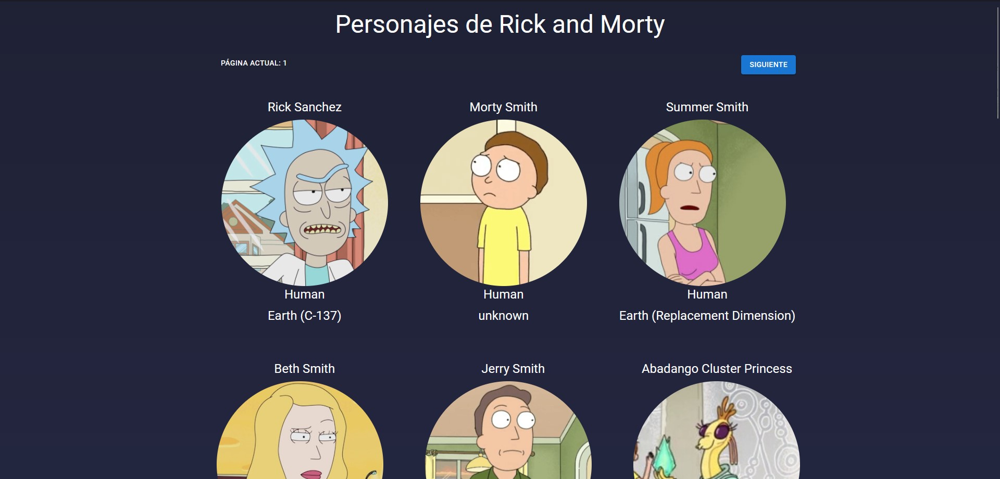

# Rick and Morty API

## 📚 Preview

## 📚 Descripción del proyecto

> Rick and Morty es una serie de televisión americana que se estrenó en septiembre de 2013.

> Desarrollado con React, Material-UI y API de [Rick and Morty API](https://rickandmortyapi.com/).

> El proyecto fue desarrollado con el fin de aprender a usar APIs de terceros.
